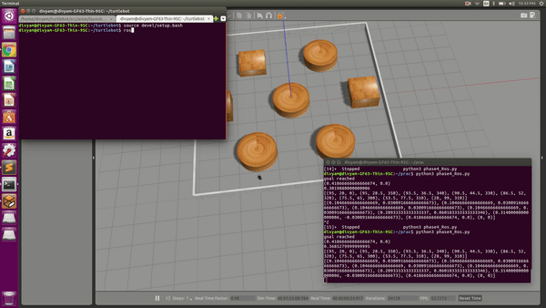
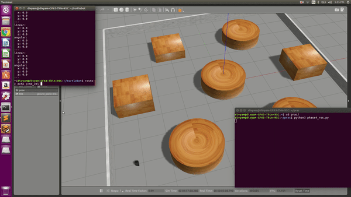
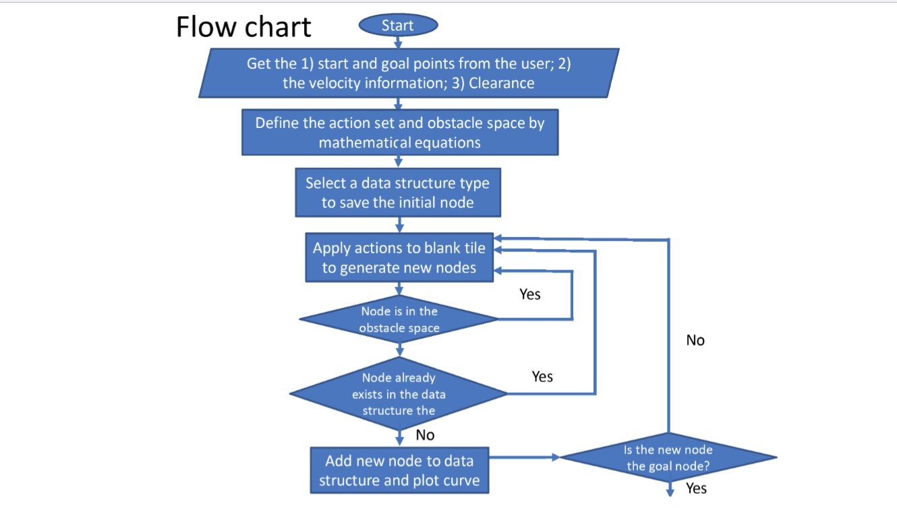
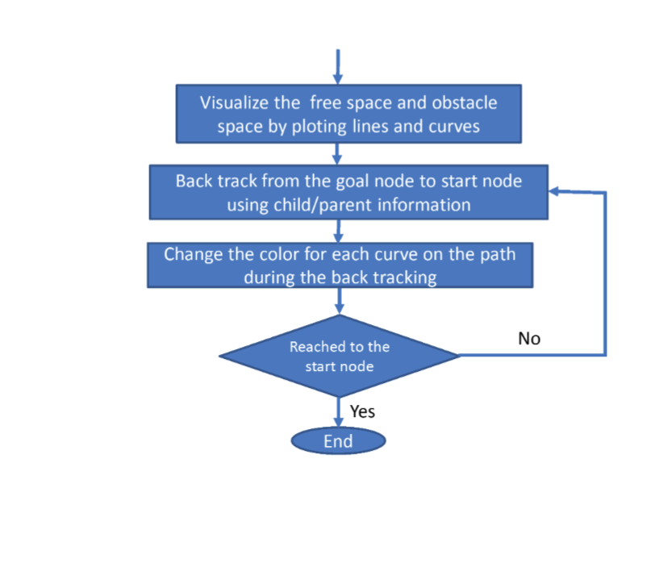

# A_star Ros simulation of turtlebot

This project is the execution of Autonomous path planning on the differential driveturtlebot robot. The algorithm used is a serach algorithm called A-star which is an optimal discrete planning. Here start position and goal position is preset. There are several random obstacles and the bot plans the most optimal way to the goal position. For this simulation non-holonomic constrainst are given to the robot which means that it cannot move in y-direction independently.

## Demonstrations




## Prerequisites

ROS kinetic or ROS melodic is required to launch the simulation.After cloning the repository the turtlebot folder can be used as it is as a ROS workspace. 

## Astar Execution




## Differential drive equations

```
x_dot = r*(ul + ur)*cos(theta)/2
y_dot = r*(ul + ur)*sin(theta)/2
theta_dot = r*(ur - ul)/l
```
